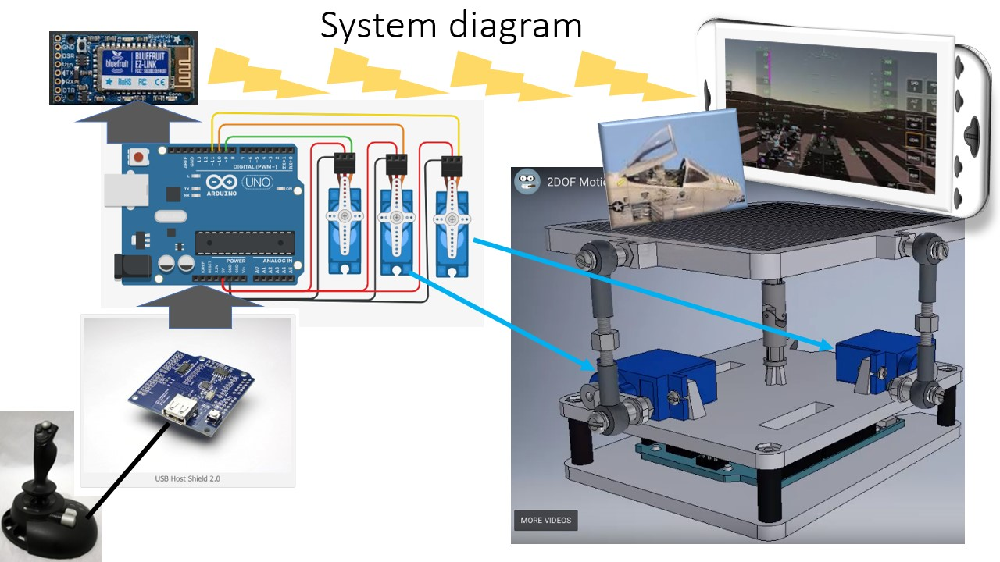

# Arduino Model Flight Simulator
## Leo Salemann, University of Washington, leos@us.edu

## Summary
A small motion platform holds an Android phone running a mobile flight simualtor and the nose of a plastic model airplane. A joystic moves platform, which in turn "runs" the simualtor as if the user were holding the phone.

## Description
There's lots of model airplanes, but what about a model flight simulator? 
This Project combines an Arduino, joystick, a Flight Simulator running on an Android phone, and the decapitated nose of a plastic airplane model. 
The Arduino reads inputs from a joystick to drive servos which change the orientation of a small motion platform. 

The platform has Android Phone running a Mobile flight simualtor, along with the plastic model just for looks.. As the platform pitches and rolls, the flight simulator 
responds as if the user were holding the phone. Components include Adafruit Metro (Arduino Uno clone) which drives drive 2 or 3 heavy-duty servos, capable of "lifting" the 
platform. The joystick will be USB, bluetooth, PC-gameport, or perhaps basic thumb joystick shields (See **Challenges**). With two servos, we can control pitch (elevator) 
and roll (ailerons).  A third servo would give us yaw(rudder) and involve mounting the motion platform on a turntable.  Throttle control would require the ability to send 
a button-press from the joystick to direclty to the Android phone over bluetooth, or a servo-driven phone stylus to tap/drag the right part of the phone at the right time. 

## System Diagram

## Challenges
The key challenge will be the joystick interface. I found a promising lead involving [a USB Host Shield from Circuits@home](https://www.circuitsathome.com/mcu/using-logitech-extreme-3d-pro-joystick-with-arduino-hid-library/)
as well as [a potentially simpler board from Hobby Electronics](http://www.hobbytronics.co.uk/usb-host-board-v2) The ultimate approach would for the ardiuo to read sitck 
postiion as well as buttons from a USB joystick, sending servo commands based on stick position and throttle, landing gear, flaps, etc direct to the Android phone via 
bluetooth. If reading the USB turns out to be too hard, I have a pre-USB joystick that uses the old game port standard; perhaps I can read those pins directly.  If that won't
 work, could get a simple Arduino Joystick Shield from [SparkFun](https://store.arduino.cc/usa/joystick-shield-kit) or [Adafruit](https://www.adafruit.com/product/512?gclid=EAIaIQobChMI89C0mMXQ3gIVCdlkCh06DwDOEAQYBCABEgLztPD_BwE).

There's another way to do this that sets the architecture on its head. Instead of using the Arduino's bluetooth shield to transmit, perhaps I can use it to receive. 
A bluetooth game controller would need to pair with the Arduino to drive the servos.  If I can pair with two devices at the same time, one controller could drive the
 servos though the Arduino while also sending throttle, flaps, landing gear commands direct to the phone.

Also see:
 [2DOF Motion Platform TinkerCAD circuit](https://www.tinkercad.com/things/eyIbdlANTBl-2dof-motion-platform)
 [Project wiki](https://dev.azure.com/HCDE539leos/Arduino%20Model%20Flight%20Simulator/_wiki/wikis/HCDE-Final-Project.wiki?wikiVersion=GBwikiMaster&pagePath=%2FArduino%252DDriven%20Model%20Flight%20Simulator)