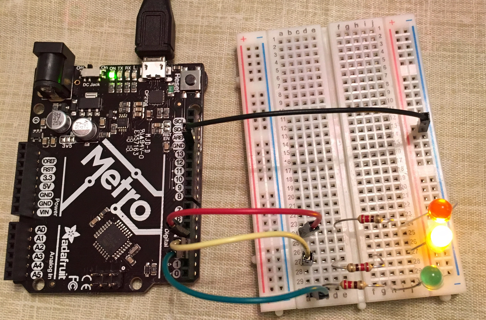

:Author: leos
:Email: leos@uw.edu
:Date: 07/10/2018
:Revision: version#c
:License: Public Domain

= Arduino-Driven LED Traffic Light

Leo J.Salemann, leow@uw.edu

Designed and simulated with https://www.tinkercad.com[Autodesk(R) Tinkercad(TM)]

Deployed to Adafruit Metro with https://create.arduino.cc[Ardino Web Editor]

Posted to https://create.arduino.cc/projecthub/projects/9cd996[Arduino Project Hub]

Submitted for Exercise 0, HCDE 539 Physical Computing, University of Washington

October 7, 2018

== Step 1: Installation

a. Open Tinkercad circuit project https://www.tinkercad.com/things/bmWjk7KrzkS-arduino-led-traffic-light-modular-code[Arduino LED Traffic Light - Modular Code]
b. Download the code from Tinkercad, upload to your Arduino IDE (desktop or cloud versions should both work).

== Step 2: Assemble the circuit

a. Wire up the Arduino Uno (or Adafruit metro), LED's, resistors, and breadboard as shown in the tinkercad drawing.
b. Also see LeosTinkerCAD_RevC.PNG, included with this sketch.

== Step 3: Load the code

From your Arduino IDE, verifiy the code then upload it to your board.

=== Folder structure

....
 HCDE_539_3O                   => Arduino sketch folder
  ├── HCDE_539_EO.ino -------------=> main Arduino file
  ├── LeosTinkerCAD_RevC.PNG ------=> Tinkercad wiring schematic
  ├── Metro_And_Breadboard.jpg ----=> Finished Product
  ├── MacBook_Metro_Breadboard.jpg => Finished Product with Macbook dev station.
  └── ReadMe.adoc -----------------=> this file
....

=== License
This project is released under a {Attribution 3.0(CC-BY 3.0)} License.

=== Contributing
To contribute to this project please contact leos <leos@uw.edu>

=== BOM
Bill of the materials needed for this project.

|===
| ID | Part name        | Part number | Quantity
| U3 | Adafruit Metro   | 50          | 1 
| D1 | Red LED          | P299B       | 1
| D2 | Yellow LED       | P2700       | 1
| D3 | Green LED        | P298B       | 1
| R  | 200 ohm Resistor | P2780A      | 3        
| A1 | Arduino Zero     | ABX00066    | 1        
|===

=== Code
----
/****************************************
 * Leo Salemann
 * HCDE 539 Physical Computing
 * University of Washinton
 * Assignment E0 Traffic Light
 * 
 * Originally from Tinkercad > Getting Started > Editing Components
 * link: https://www.tinkercad.com/things/dTAcB2IUt0I-editing-components/editel?collectionid=OIYJ88OJ3OPN3EA&lessonid=EFU6PEHIXGFUR1J&projectid=OIYJ88OJ3OPN3EA#/lesson-viewer
 *****************************************/

/*
 * In TinkerCad, the pins are 0, 1, 2 but that causes an error:
 *   avrdude stk500_getsync() not in sync resp=0x30
 * After much googling, I found a solution that suggested to avoid using pin 0
 *   https://www.instructables.com/id/A-solution-to-avrdude-stk500getsync-not-in-syn/
 * Actually, my professor advised starting at pin 2.
 */
int led_red    = 4; // the red    LED is connected to Pin 4 of the Arduino
int led_yellow = 3; // the yellow LED is connected to Pin 3 of the Arduino
int led_green  = 2; // the green  LED is connected to Pin 2 of the Arduino

void setup() {
  // set up all the LEDs as OUTPUT
  pinMode(led_red, OUTPUT);
  pinMode(led_yellow, OUTPUT);
  pinMode(led_green, OUTPUT);
}

void stop (int stop_time) {
  // turn the red LED on and the other LEDs off
  digitalWrite(led_red, HIGH);  
  digitalWrite(led_yellow, LOW);
  digitalWrite(led_green, LOW);
  delay(stop_time * 1000);  // wait stop_time seconds 
}

void caution (int caution_time) {
  // turn the yellow LED on and the other LEDs off
  digitalWrite(led_red, LOW);   
  digitalWrite(led_yellow, HIGH);
  digitalWrite(led_green, LOW);
  delay(caution_time * 1000);   // wait caution_time seconds
}

void go (int go_time) {
  // turn the green LED on and the other LEDs off
  digitalWrite(led_red, LOW); 
  digitalWrite(led_yellow, LOW);
  digitalWrite(led_green, HIGH);
  delay(go_time * 1000);  // wait go_time seconds 
}

void loop() {
  go(2);
  caution(1);
  stop(10);
}

----

=== Pics
.Schematic

.Finished Product

=== Further Reading
https://github.com/LeoSalemann/UW_HCDE539/tree/master/Class01/HCDE_539_EO[Github Repo]
https://create.arduino.cc/projecthub/leos/hcde-539-assignment-1-a-3-led-traffic-light-9cd996[Arduino Project Hub]

=== Help
This document is written in the _AsciiDoc_ format, a markup language to describe documents. 
If you need help you can search the http://www.methods.co.nz/asciidoc[AsciiDoc homepage]
or consult the http://powerman.name/doc/asciidoc[AsciiDoc cheatsheet]
