:Author: leos
:Email: leos@uw.edu
:Date: 14/10/2018
:Revision: version#
:License: Public Domain

= Individual Builds (Sensors, Motors, Wildcard)

Leo J.Salemann, leow@uw.edu

Designed and simulated with https://www.tinkercad.com[Autodesk(R) Tinkercad(TM)]

Deployed to Adafruit Metro with https://create.arduino.cc[Ardino Web Editor]

Posted to https://create.arduino.cc/projecthub/projects/9cd996[Arduino Project Hub]

Submitted for Exercise 1, HCDE 539 Physical Computing, University of Washington

October 15, 2018

= Overview
For the initial design and implementation, I created a "Sensor Smorgasbord" project in which I combined all four individual builds onto one bread board, and wrote a single program to run everything. The project was "born in the cloud" using TinkerCad and the Arduino Web Editor. I then reimplmented the Smorgasboard in Fritzing, then made copies to reduce it down to Light sensor only, Magnetic Sensor only, etc. 

.Sensor Smorgasbord (Fritzlab & Photo)
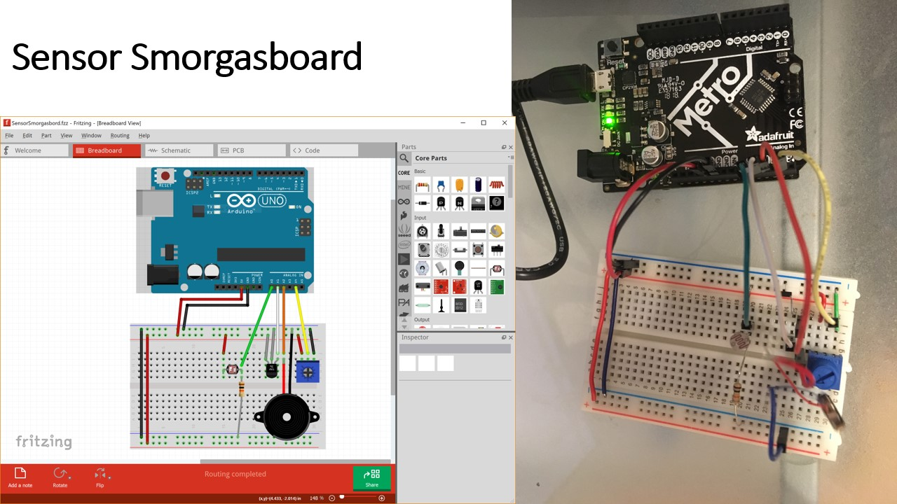

= Light Sensor
The light sensor is implemented according to the adaffruit description at https://www.adafruit.com/product/161. One pin is connected to 5V; the other is connected to Arduino Analog pin A0 as well as a grounded 220 ohm resistor. The code initializes the pin as input, reads it, and prints a value to the serial monitor. Values range from 22 in a dark room, 735 under regular room lighting, and 1017  when illuminted by an iPhone "flashlight" at point-blank range.

== Photos
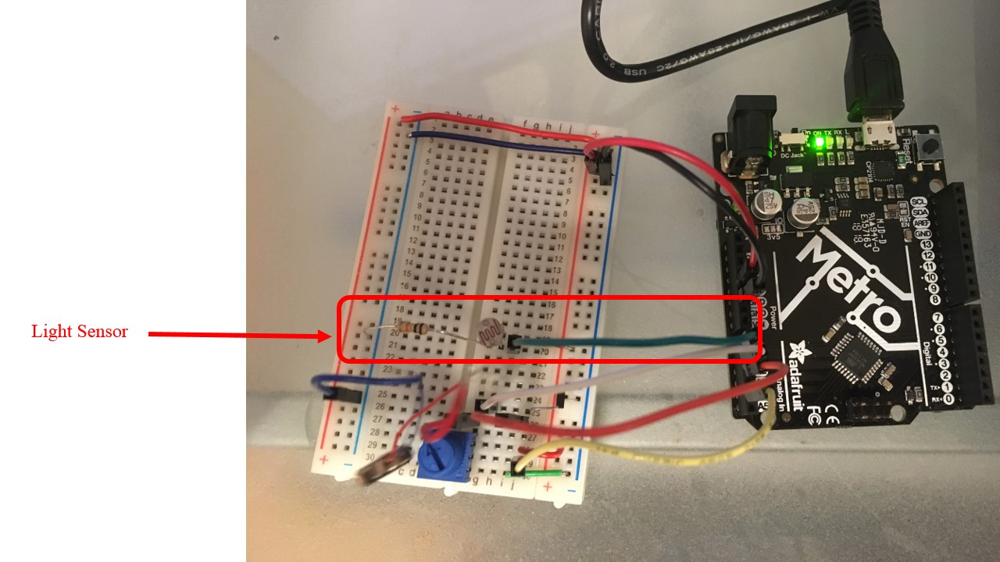

== Sketch Code

----
/****************************************
 * Leo Salemann
 * HCDE 539 Physical Computing
 * University of Washinton
 * Assignment E0 Traffic Light
 * 
 * Originally from Tinkercad > Getting Started > Editing Components
 * link: https://www.tinkercad.com/things/dTAcB2IUt0I-editing-components/editel?collectionid=OIYJ88OJ3OPN3EA&lessonid=EFU6PEHIXGFUR1J&projectid=OIYJ88OJ3OPN3EA#/lesson-viewer
 *****************************************/
 
 ----
 
== Schematic
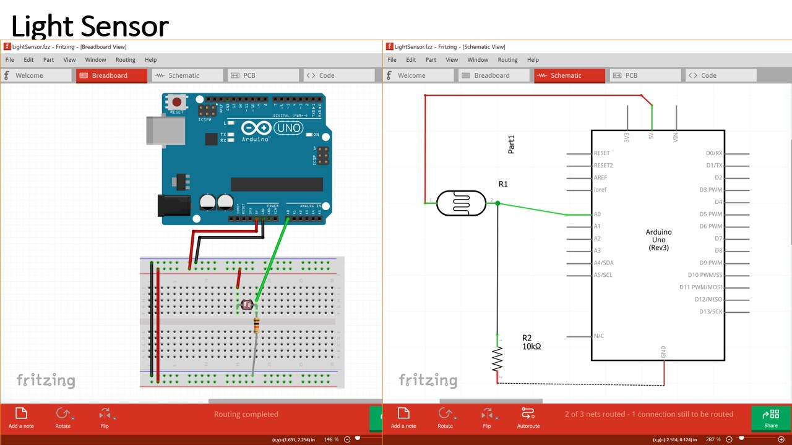

== Serial Monitor Output
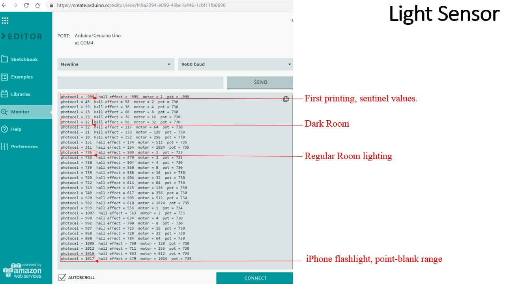

== Problems, Successes Learnings
Switch from 10kOhm to 220Ohm resistor.

= Magnetic Sensor
Describe your project

== Photos
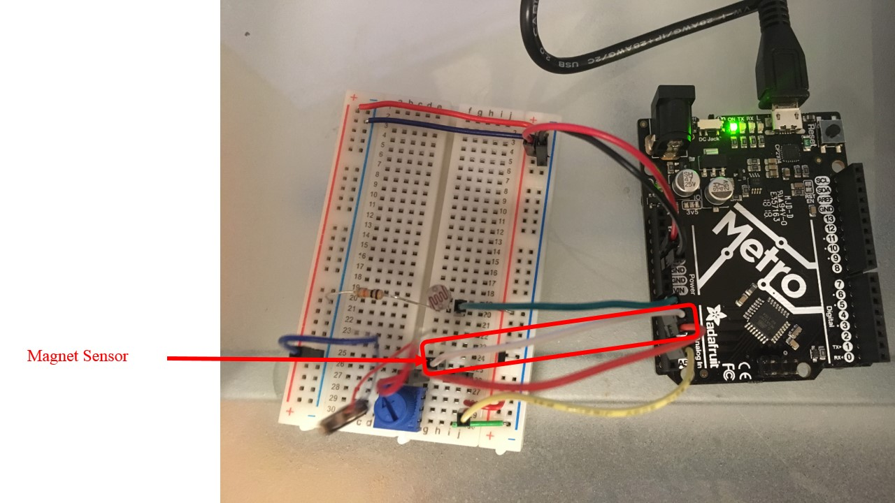

== Sketch Code

== Schematic
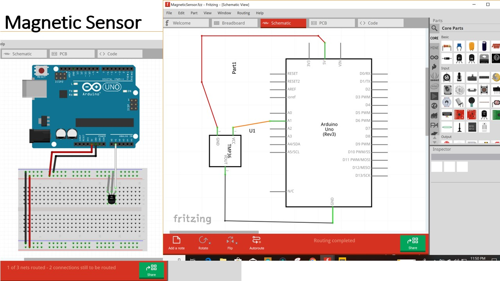

== Serial Monitor Output
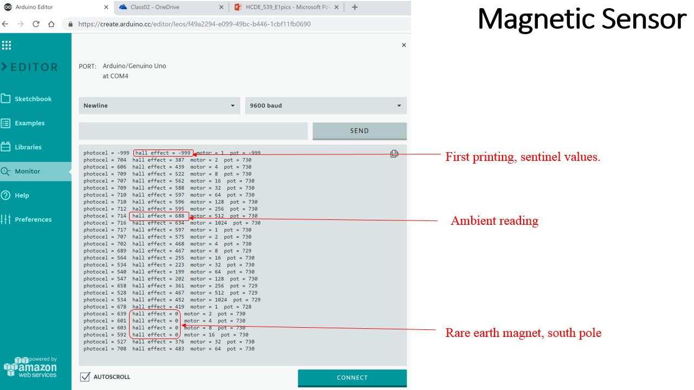

== Problems, Successes Learnings

= Motor
Describe your project

== Photos
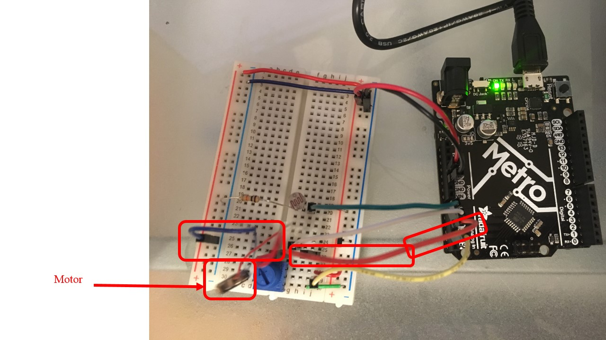

== Sketch Code

 
== Schematic
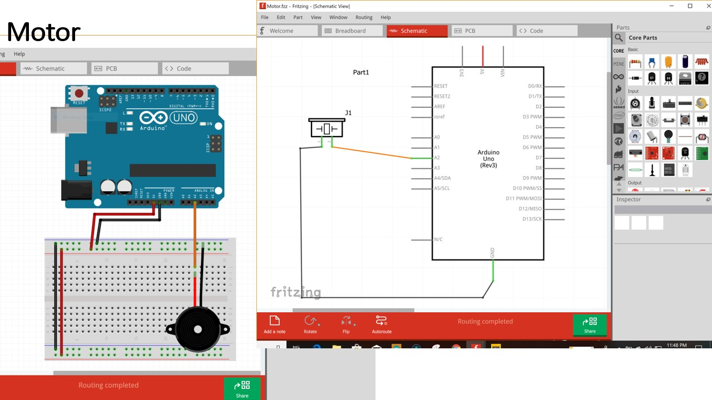

== Serial Monitor Output
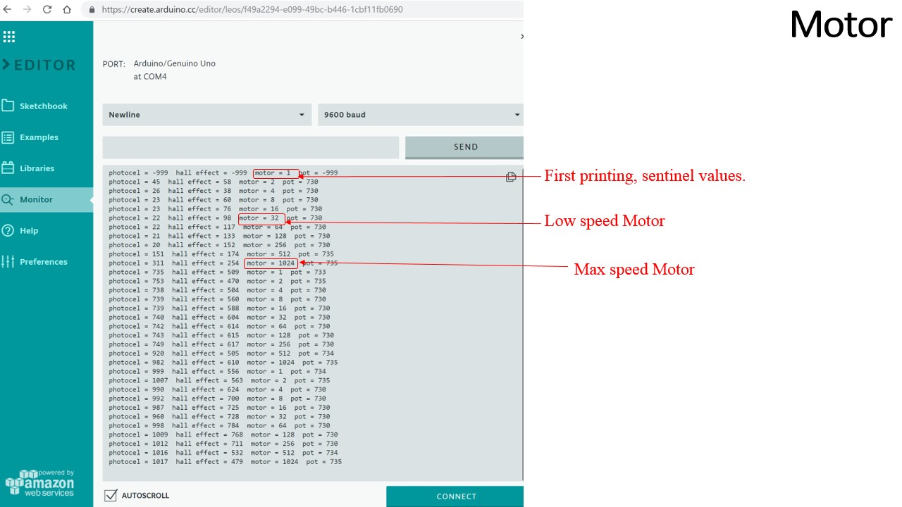

== Problems, Successes Learnings

= Wildcard (Potentiometer)
Describe your project

== Photos
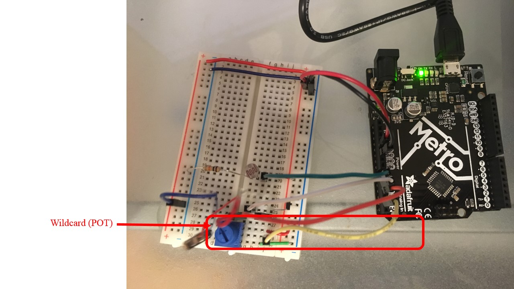

== Sketch Code

== Schematic
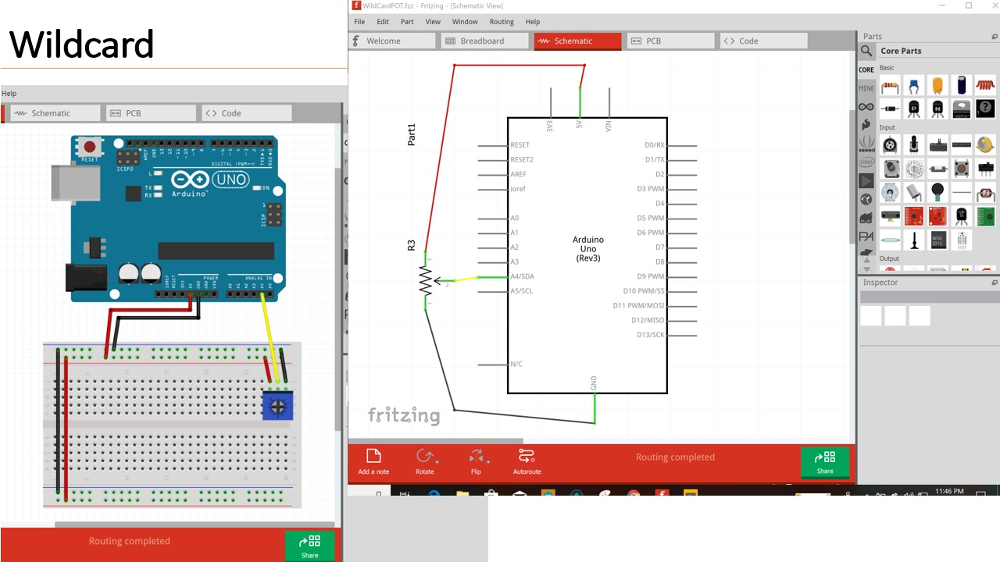

== Serial Monitor Output
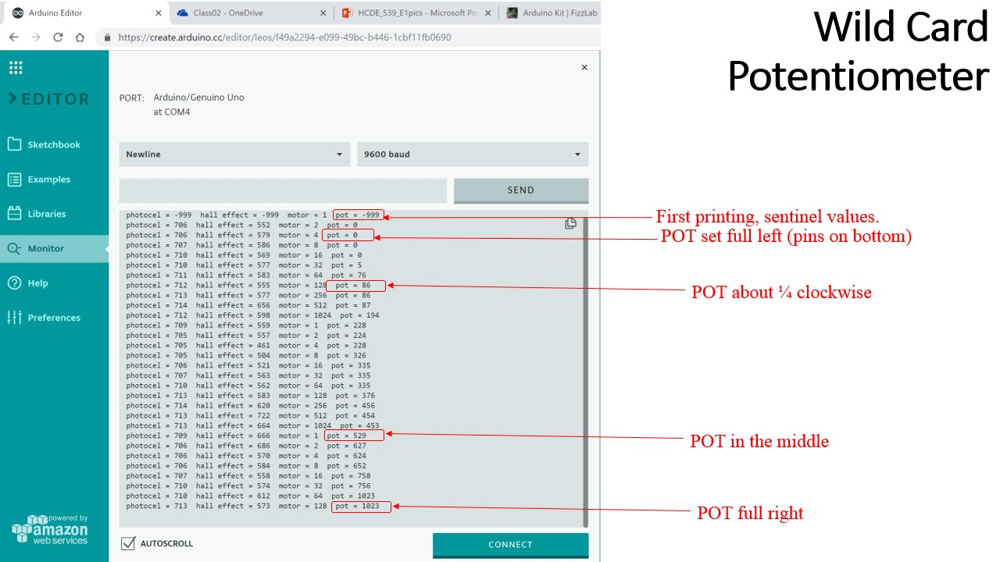

== Problems, Successes, Learnings

=== Help
This document is written in the _AsciiDoc_ format, a markup language to describe documents. 
If you need help you can search the http://www.methods.co.nz/asciidoc[AsciiDoc homepage]
or consult the http://powerman.name/doc/asciidoc[AsciiDoc cheatsheet]
